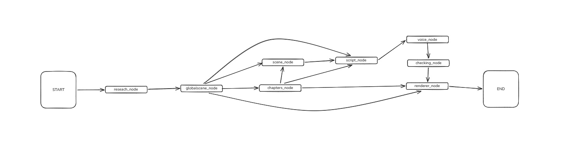

**Language:** English
> [!WARNING]
> This Repository is not longer maintained. [New Repository](https://github.com/devankSinghChaudhary/VPipeline)

--- 
# Video Generating Pipeline

AI-powered documentary and educational video generation pipeline built with LangGraph and NVIDIA NIM.

[](https://www.python.otg)
[](https://langchain.com/langgraph)
[](https://build.nvidia.com)
[](https://mistral.ai/)
[]()

[](https://instagram.com/devanksinghchaudhary)

---

## Overview

Video Generating Pipeline is an AI driven system that transforms a single topic into structured research, documentary scripts, and eventually production-ready video assets.

Instead of relying on a single prompt, the pipeline uses multiple specialized AI agents that work together to:

* Perform research
* Extract and organize knowledge
* Information retrieval
* Generate short form documentary scripts
* Convert into TTS Friendly script
* Whisper used for getting that word spoken accuracy
* Remotion then take over for rendering

---

## Architecture
> Rough Architecture



---

## Features

* Multi-Agent Research System
* Parallel AI Researchers
* LangGraph Orchestration
* Structured Research Outputs
* Vector Database Integration
* Long-Form Documentary Generation
* NVIDIA NIM Support
* Local & Cloud Model Compatibility

---

## Example

**Input**

```text
India reaches 3rd stage fast breeder reactor
```

**Pipeline**

```text
Topic Analysis
    ↓
Research Planning
    ↓
Parallel Domain Research
    ↓
Knowledge Storage
    ↓
Global Scene Writing
    ↓
Smaller Scenes Writing
    ↓
Script Writing
    ↓    
Video Generation
```

---

## Tech Stack

* Python
* LangGraph
* LangChain
* Pydantic
* NVIDIA NIM
* Vector Database
* Local LLM Support

---

## Roadmap

### Research Layer

* [x] Perspective Generation
* [x] Parallel Research Agents
* [ ] Fact Verification
* [ ] Citation Tracking
* [ ] Timeline Extraction

### Knowledge Layer

* [ ] Vector Database Integration
* [ ] Knowledge Graph
* [ ] Long-Term Memory

### Script Layer

* [ ] Documentary Outline Generation
* [ ] Multi-Pass Script Writing
* [ ] Narrative Optimization

---

## Running

```bash
git clone https://github.com/DevankSinghChaudhary/video-creation-pipeline
cd video-creation-pipeline
uv run main.py
```


---

## Author: 
**Devank Singh Chaudhary** \
[Instagram](https://instagram.com/devanksinghchaudhary) \
[X/Twitter](https://x.com/@devank0) \
[Email Me](mailto:devanksinghchaudhary@gmail.com)

